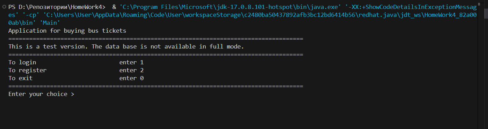

### Урок 4. Компоненты. Принципы связности и сочетаемости компонентов

Дорабоать приложение для покупки он-лайн билетоа на автобус.

### В Models:

Определим переменные balance и card и добавим их в класс BankAccount.

Добавим недостающие переменные в класс Ticket. 

Теперь переменные routeNumber, place, price, date и isValid определены, и добавлены геттеры и сеттеры для них.

Добавим недостающие переменные в класс User.

Теперь переменные id, userName, hashPassword и cardNumber определены, и добавлены геттеры и сеттеры для них.

### В Services

Добавим метод getValid в класс TicketRepository. 

Метод getValidTickets добавлен, и он возвращает список всех валидных билетов.

Запустим приложение:

