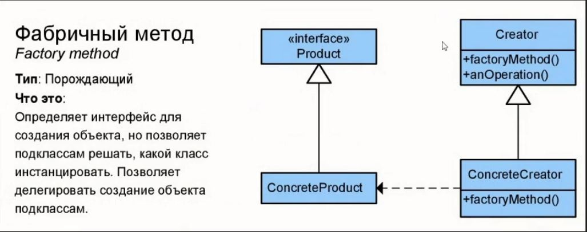

## Урок 2. Объектно-ориентированные паттерны

### Задание 1. 
Закончить разработку паттерна Фабричный метод. 

### Задание 2. 
Познакомиться с другими типами паттернов (задание по желанию).

### Схема паттерна "Фабричный метод"

Благодаря этому паттерну можем включать или выключать фабрики.(Н: Такси, строительство домов, доставка)

Другие типы паттернов в файле templates.pdf
[templates.pdf](./templates.pdf)

В task002 отражены следующие паттерны:

Порождающий паттерн проектирования (Singleton)
Описание в файле README 2.md  

Состояние — поведенческий паттерн (State)
Описание в файле README 3.md

