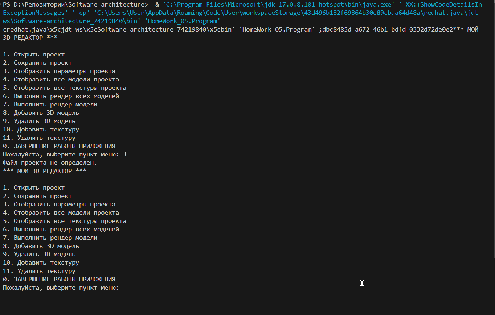

# Проект "3D Графический Редактор"

Этот проект представляет собой консольное приложение для работы с 3D графикой. Он позволяет открывать, редактировать и сохранять проекты, а также выполнять рендеринг 3D моделей.

## Описание

Проект разделен на несколько основных компонентов:

- `Editor3D`: Класс, представляющий графический редактор 3D графики. Он управляет всеми операциями с проектом.

- `UILayer`: Интерфейс, определяющий методы для взаимодействия с пользователем, такие как открытие проекта, сохранение, вывод информации о проекте и др.

- `EditorBusinessLogicalLayer`: Класс, реализующий бизнес-логику редактора. Он управляет добавлением, удалением и рендерингом моделей и текстур.

- `EditorDatabaseAccess`: Класс, обеспечивающий доступ к базе данных для хранения моделей и текстур.

- `EditorDatabase`: Класс, представляющий базу данных проекта. Он загружает и сохраняет данные о моделях и текстурах.

- `Model3D` и `Texture`: Классы, представляющие 3D модели и текстуры соответственно.

## Использование

Для использования приложения выполните следующие шаги:

1. Запустите `Program.java`.

2. Следуйте инструкциям в консоли для выбора операций, таких как открытие/сохранение проекта, добавление/удаление моделей и текстур, а также выполнение рендеринга.

3. Запуск приложения
   
   